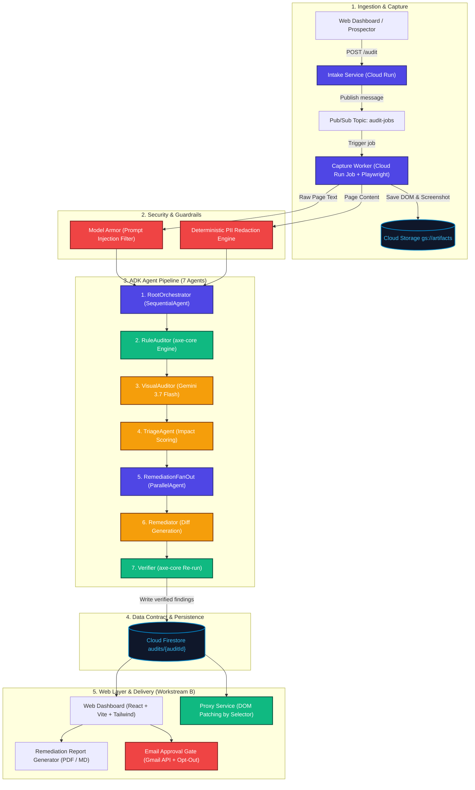
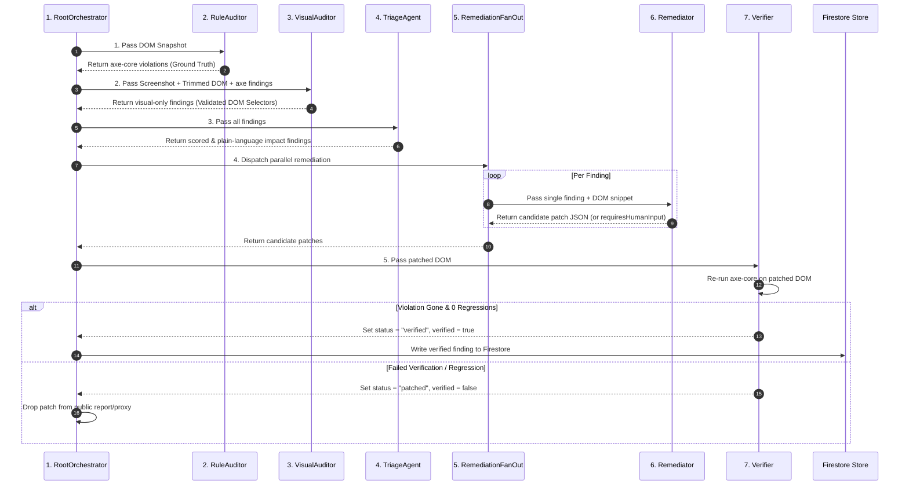
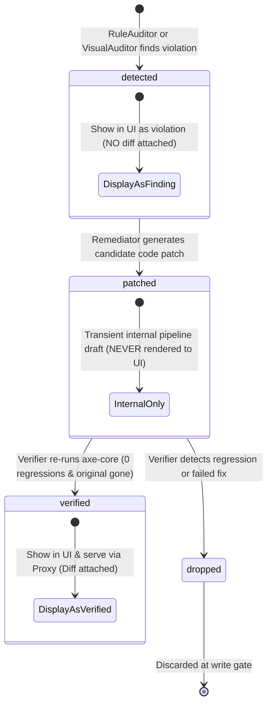
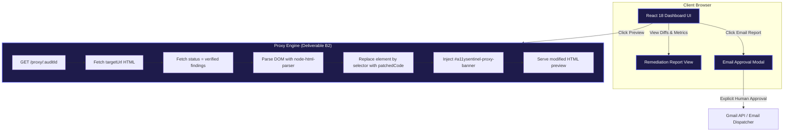

# A11ySentinel — Architecture Diagram & System Design

> **Hackathon Track:** Taskmaster  
> **Google Agent Framework:** Google ADK (Python)  
> **Primary Model:** Gemini 3.7 Flash (Vertex AI `global` endpoint)  
> **Rule Engine:** axe-core 4.10.2 (Deterministic ground truth)  
> **Infrastructure:** Cloud Run, Cloud Run Jobs, Pub/Sub, Firestore, Cloud Storage, Model Armor  

---

## 1. System Architecture Overview

A11ySentinel is built as an autonomous background agent pipeline. It receives untrusted third-party web pages, audits them for WCAG 2.1 AA / RGAA 4 accessibility violations, generates source-level code diffs, verifies each fix using a deterministic rule engine, and serves a live corrected proxy preview under human approval.

---

## 2. The 7 ADK Agents Breakdown

The central pipeline consists of **seven ADK agents** orchestrated by a `SequentialAgent`:

### Agent Register Summary

| # | Agent Name | ADK Primitive Type | Gemini Model ? | Deterministic vs Generative | Core Responsibility |
|---|---|---|---|---|---|
| **1** | **`RootOrchestrator`** | `SequentialAgent` | No | Deterministic | Orchestrates agent sequence (2 → 3 → 4 → 5 → 7), manages session state and writes audit status transitions. |
| **2** | **`RuleAuditor`** | Custom `BaseAgent` | No | Deterministic | Injects `axe-core 4.10.2` via Playwright Chromium. Establishes the **ground truth**. Maps WCAG 2.1 AA to RGAA 4. |
| **3** | **`VisualAuditor`** | Custom `BaseAgent` | **Gemini 3.7 Flash** | Generative + Code Validation | Analyzes screenshot + trimmed DOM. Catches visual flaws static rules miss. Validates every returned selector against DOM before keeping. |
| **4** | **`TriageAgent`** | `LlmAgent` | **Gemini 3.7 Flash** | Generative | Scores severity × user impact × effort. Rewrites impact into plain-language consequence. |
| **5** | **`RemediationFanOut`** | `ParallelAgent` | No | Deterministic | Dispatches one `Remediator` instance per finding with bounded concurrency. |
| **6** | **`Remediator`** | `LlmAgent` | **Gemini 3.7 Flash** | Generative | Generates targeted source diffs (`patchedCode`) anchored by CSS selector. Sets `requiresHumanInput: true` when content cannot be inferred. |
| **7** | **`Verifier`** | Custom `BaseAgent` | No | Deterministic | Re-applies patch to DOM snapshot, re-runs `axe-core`. Confirms violation is gone & 0 regressions. Sets `status: "verified"`. |

---

## 3. Data Flow & State Lifecycle (`status`)

Every audit finding follows an explicit state transition contract defined in `contracts/schema.md` (Draft 4):

---

## 4. Security & Ingestion Defense Layers

Because A11ySentinel ingests arbitrary third-party web content (untrusted input), it implements a multi-layered defense architecture:

```mermaid
flowchart LR
    UNTRUSTED["Untrusted Web Page"] --> L1["Layer 1: DOM Sanitisation"]
    L1 -->|Strip scripts, styles, comments| L2["Layer 2: Deterministic PII Redaction"]
    L2 -->|Redact emails, phone, IBAN, cards| L3["Layer 3: Model Armor Classifier"]
    L3 -->|Screen for indirect prompt injections| L4["Layer 4: Gemini LLM Evaluation"]
    L4 --> L5["Layer 5: Selector DOM Validation"]
    L5 --> L6["Layer 6: Verifier axe-core Re-run"]

    classDef guard fill:#991b1b,color:#fff,stroke:#f87171,stroke-width:2px;
    class L1,L2,L3,L5,L6 guard;
```

1. **DOM Sanitisation:** Strips `<script>`, `<style>`, inline event handlers, and comments before sending to LLM.
2. **Deterministic PII Redaction:** Local regex/token engine redacts personal data (emails, phone numbers, IBANs, credit card numbers) before LLM ingestion. Fails closed.
3. **Google Cloud Model Armor:** Evaluates text blocks for prompt injection / jailbreak attempts.
4. **Selector DOM Validation:** Every selector returned by Gemini is queried against the live DOM in code. Unmatched selectors are discarded immediately.
5. **Verifier Write Gate:** Only patches that pass an automated `axe-core` re-run are written to Firestore as `status: "verified"`.

---

## 5. Web & Delivery Architecture (Workstream B)

The web layer consumes data written to Firestore and Cloud Storage:

* **Web Dashboard:** React 18 + Vite + TailwindCSS app displaying measured before/after violation counts (`violationsBefore` → `violationsAfter`), priority action items, screen reader announcement comparisons (`announcedBefore` → `announcedAfter`), code diffs, and editorial guidance modals.
* **Proxy Service:** Server component fetching target HTML, filtering `status === "verified"` findings, replacing elements matched by CSS `selector` with `patchedCode`, and injecting a sticky preview header banner.
* **Remediation Report Generator:** Structured remediation document generator with print/PDF layout (`window.print()`) and Markdown file exporter.
* **Email + Approval Gate:** Human-in-the-loop email dispatch system enforcing neutral non-litigious copy and mandatory opt-out footer lines.

---

## 6. Infrastructure Component Mapping (Google Cloud)

| Component | GCP Infrastructure Service | Configuration & Scale |
|---|---|---|
| **Intake Service** | Cloud Run | `a11ysentinel-pipeline` (`us-central1`) |
| **Asynchronous Job Queue** | Cloud Pub/Sub | Topic `audit-jobs`, push subscription |
| **Heavy Capture Worker** | Cloud Run Jobs | Playwright Chromium, 2 vCPU, 4GB RAM |
| **Guardrails & Security** | Google Cloud Model Armor | Template `a11ysentinel-screen` (`us-central1`) |
| **LLM Inference** | Vertex AI | Gemini 3.7 Flash (`global` endpoint) |
| **Audit Persistence** | Cloud Firestore | Collections `audits/{auditId}` and `findings/{findingId}` |
| **Artifact Storage** | Cloud Storage (`gs://`) | Bucket `gs://a11ysentinel-artifacts` |
| **Proxy & Web UI** | Cloud Run / Node.js | Hosted Web Layer & Proxy Service |
